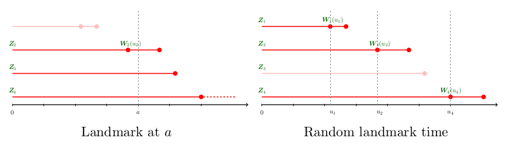

\newcommand{\bmX}{{\mathbf X}}
\newcommand{\bmW}{{\mathbf W}}
\newcommand{\bmZ}{{\mathbf Z}}

<script type="text/x-mathjax-config">
MathJax.Hub.Config({
  TeX: { equationNumbers: { autoNumber: "AMS" } }
});
</script>

```{r default, include = FALSE}
knitr::opts_chunk$set(prompt = TRUE, comment = "")
```

In this vignette, we first generate a simulated data from an illness-death model
then apply landmark analysis with package `dynTree` assming a fixed landmark time. 

## Simulated data

Consider a survival model with 20 predictors, of which 10 are time-independent predictors and 
the other 10 are longitudinal predictors. 
Suppose the predictors were generated from the following description:

  - The time-independent predictors $\bmZ = \{Z_1, \ldots, Z_{10}\}$ are generated from a multivariate normal random variable
with $E(Z_i) = Var(Z_i) = 1$, and $Cov(Z_i, Z_j) = 0.5^{|i - j|}$, for $i, j = 1, \ldots, 10$.
  - The longitudinal predictors $\bmW(t) = \{W_1(t), \ldots, W_{10}(t)\}$ were generated from $W_i(t) = a_iF(b_it) / t$
  for $i = 1, \ldots, 10$, where $a_i$ follows a uniform distribution on $[-1, 1]$, $b_i$ follows a standard uniform distribution, and $F(x) = 1 - e^{-x^2}$.

In a illness-death model with three states: healthy, diseased, and death, 
we assume all patients started in the healthy state and can transit to the death state 
with or without first transiting to the diseased state. 
We also assume all states were irreversible,
so that only the transition paths health$\rightarrow$diseased$\rightarrow$death and health$\rightarrow$death are allowed.
The diseased state is considered as an intermediate event and
the longitudinal predictors $\bmW(t)$ are measured at the time of the intermediate event.
In this scenario, both the fixed landmark time or a random landmark time (intermediate event) can be considered. 
We generated the falure time $T$ based on the following algorithm. 


We first generated an event time, $D$, from the accelerated failure time model, 
$$\log (D) = -1 + \bmZ\theta_1^\top + \gamma + \epsilon_1,$$
where $\epsilon_1$ is an independent standard normal random variable and the frailty variable $\gamma$
follows a gamma distribution with mean 1 and variance 0.5.
Define the disease indicator, $\Pi$, where $\Pi = 1$ if the subject moves from the healthy state to the disease state
at time $D$, and $\Pi = 0$ if the subject moves from the healthy state to death at time $D$.
The disease indicator was obtained via the following model
$$\mbox{logit}\left[P\left\{\Pi = 1 | \bmZ, \bmW(D)\right\}\right] = 1 + \bmZ\theta_1^\top + \bmW(D)\theta_2^\top + \gamma.$$
Given a subject had developed the disease at time $D$, 
the residual survival time, $R$, was generated from 
$$\log(R) = -1 + \bmZ\theta_1^\top + \bmW(D)\theta_2^\top + \bmZ\theta_1^\top \cdot \bmW(D)\theta_2^\top - \log(1 + D) + \gamma + \epsilon_2,$$
where $\epsilon_2$ is a standard normal random variable. 
When $\Pi = 1$, the time to death is $T = D + R$ and the time to the intermediate event is $U = D$; 
when $\Pi = 0$, the time to death is $T = D$ and the intermediate event does not occur. 


With $\theta_1 = (0, 0, 0, 0, 1, 1, 1, 1, 1, 0)^\top$ and $\theta_2 = (1, 1, 1, 1, 1, 0, 0, 0, 0, 0)$, 
one draw of failure time under the above specification can be obtained by the following code: 
```{R}
library(MASS)
set.seed(1)
a <- runif(10, -1, 1)
b <- runif(10)
z <- matrix(mvrnorm(1, rep(1, 10), .5^outer(1:10, 1:10, function(x, y) abs(x - y))), 1) / 10
g <- rgamma(1, 2, 2)
t1 <- t2 <- NULL
t1 <- exp(sum(-1, z[5:9], g, rnorm(1)))
Wt1 <- a * pweibull(b * t1, 2) / t1
pi1 <- 1 / (1 + exp(-sum(1, Wt1[1:5], z[5:9], g)))
t2 <- ifelse(rbinom(1, 1, pi1),
             exp(sum(-1, z[5:9], Wt1[1:5], Wt1[1:5] * z[5:9], -log(1 + t1), g, rnorm(1))), NULL)
c(t1, t2)
```
Under this random seed, the subject is said to transit from the healthy state to the diseased state at time `r round(t1, 3)`
then transit from the diseased state to the death state at time `r round(t2, 3)`.


A `data.frame` containing parameters `a`, `b`, `z`, and failure times, for `n` individuals can be constructed 
using the following function.
```{R}
getDat <- function(n) {
    z <- mvrnorm(n, rep(1, 10), .5^outer(1:10, 1:10, function(x, y) abs(x - y))) / 10
    a <- matrix(runif(10 * n, -1, 1), n)
    b <- matrix(runif(10 * n), n)
    g <- rgamma(n, 2, 2)
    t1 <- exp(-1 + rowSums(z[,5:9]) + g + rnorm(n))
    Wt1 <- a * pweibull(b * t1, 2) / t1
    pi1 <- 1 / (1 + 1 / exp(1 + rowSums(Wt1[,1:5] + z[,5:9]) + g))
    t2 <- ifelse(!rbinom(n, 1, pi1), NA,
                 exp(-1 + rowSums(Wt1[,1:5] + z[,5:9] + Wt1[,1:5] * z[,5:9]) - log(1 + t1) +
                     g + rnorm(n)))
    data.frame(id = 1:n, Time1 = t1, Time2 = t2, z = z, a = a, b = b)
}
set.seed(74); dat <- getDat(400)
dim(dat); names(dat)
head(dat[,1:3])
```
Each row in `dat` represents information for one subject. 
The subject identifications are stored in column `id` and the time the subject leaves the healthy state
is stored in column `Time1`. 
The subject is said to transit from the healthy state to the death state if `Time2` is `NA`, e.g., subject `id = 3`.
Otherwise, the subject is said to transit from the healthy state to the diseased state at `Time1`, 
then from the diseased state to death at `Time1 + Time2`.


Let $U$ be the time to the intermediate event and
suppose the longitudinal predictors `\bmW(t)` are measured at the $U$.
The landmark time can be either fixed or subject-specific (at intermediate event).
The number of available predictors varies across subjects at the landmark time
as illustrated in the following figure:



When the landmark time is fixed at $a$ (say $a = 1$) as in the left panel, 
$\bmW(U)$ is observed only for these 
who have transited to the diseased state by $t$, i.e., subject `id = 2`. 
Subject `id = 1` is not included in the analysis when the landmark time is 1 because 
the corresponding failure time falls short of $a = 1$.
On the other hand, subjects `id = 3` and `id = 4` are included in the analysis but their 
$\bmW(U)$ are not available at the landmark time.
In this case, the probabilities of interest are 
$$P\{T - a\ge t\,|\,T\ge a, U, \bmW(U), \bmZ\}, \mbox{ if } U\ge a$$
and 
$$P\{T-a\ge t\,|\,T\ge a, U>a, \bmZ\}, \mbox{ if } U > a.$$

When the landmark time is the intermediate event time, $U$, as in the right panel of the figure,
$\bmW(U)$ is available for all subjects in the risk set. 
Subjects who did not experience an intermediate event, e.g., subject `id = 3`, are excluded from the landmark model.
In this case, the probability of interest is 
$$P\{T\ge U + t\,|\, T\ge U, U, \bmW(U), \bmZ\}.$$

## Axis-parallel partition rule

A common partition rule is the "axis-parallel" partition rule that is in the form of 
"Is the variable to be splitted greater than $a$?" for a cutoff value $a$.
When the landmark time is fixed at $a$, the candidate spliting variable $\bmW(a)$ is ordinal in the sence that
the splitting based on $\bmW(a)$, the cut-off value $c$ cannot exceed $a$ because $\bmW(a) = a^+$ is 
considered as the smallest partition unit. 
When the splitting rule is $\bmW(a) > a$, the right child node consists of subjects 
who have not experienced the intemediate event before the landmark time. 


## 
The following code modifies the above `getDat()` function to accomdiate the landmark times and censoring.

## Reference