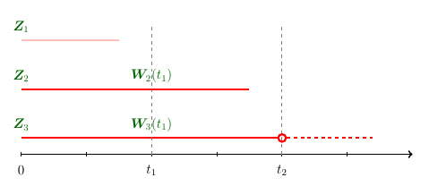

\newcommand{\bmX}{{\mathbf X}}
\newcommand{\bmW}{{\mathbf W}}
\newcommand{\bmZ}{{\mathbf Z}}

<script type="text/x-mathjax-config">
MathJax.Hub.Config({
  TeX: { equationNumbers: { autoNumber: "AMS" } }
});
</script>

```{r default, include = FALSE}
knitr::opts_chunk$set(prompt = TRUE, comment = "")
```

In this vignette, we first generate a simulated data with longitudinal measures
then apply landmark analysis with package `dynTree` assming a fixed landmark time. 

## Simulated data

Consider a survival model with 20 predictors, of which 10 are time-independent predictors and 
the other 10 are longitudinal predictors. 
Suppose the predictors were generated from the following description:

  - The time-independent predictors $\bmZ = \{Z_1, \ldots, Z_{10}\}$ are generated from a multivariate normal random variable
with $E(Z_i) = Var(Z_i) = 1$, and $Cov(Z_i, Z_j) = 0.5^{|i - j|}$, for $i, j = 1, \ldots, 10$.
  - The longitudinal predictors $\bmW(t) = \{W_1(t), \ldots, W_{10}(t)\}$ were generated from $W_i(t) = a_iF(b_it) / t$
  for $i = 1, \ldots, 10$, where $a_i$ follows a uniform distribution on $[-1, 1]$, $b_i$ follows a standard uniform distribution, and $F(x) = 1 - e^{-x^2}$.

In a longitudinal setting, $\bmW(t)$ are regularly measured at fixed time points, $t_1<\ldots <t_k$. 
As time progresses, each $t_k$ can serve as a landmark time and predicting the event risk on the time interval
$(t_k, t_{k + 1})$ using predictors information observed up to $t_k$ would be of interest. 
That is, at the landmark time $t_k$, we are interested in predicting 
$$P\{T\ge t_k + t | T\ge t_k, \bmW(t_1), \ldots, \bmW(t_{k}), \bmZ\}$$ 
for $0<t<t_{k + 1} - t_k$ and $k\ge1$. 
To illustrate the usage of the `dynTree` package on application like this, we generated
the falure time $T$ based on the following hazard function, 
$$\lambda\{t|\bmW(t), \bmZ\} = 1.6 I(t > 1) + 0.5 \exp\left\{ \theta_1\bmW(t) + \theta_2\bmZ + \theta_1\theta_2\bmW(t)\bmZ\right\},$$
where $\theta_1$ and $\theta_2$ are the corresponding regression coefficients.
The following functions `hz()` and `Hz()` specify the above hazard function given $(\bmZ, a, b)$ 
and a numerical approximation of $\Lambda(t) = \int_0^t \lambda\{u|\bmW(t), \bmZ\}\,du$.
```{R}
hz <- function(tt, a, b, z) {
    Wt <- a * pweibull(b * tt, 2) / tt
    1.6 * (tt > 1) + .5 * exp(sum(Wt) - sum(z) + sum(Wt * z))
}
Hz <- function(tt, a, b, z) {
    integrate(f = function(y)
        sapply(y, function(yy) hz(yy, a = a, b = b, z = z)),
        lower = 0, upper = tt, subdivisions = 500L)$value
}
```
The following function is used to generate failure time, $Y$, based on inverse transform method.
```{R}
getY <- function(a, b, z, u) {
    if (exp(-Hz(10, a, b, z)) > u) return(1e-3)
    uniroot(f = function(s) exp(-Hz(s, a, b, z)) - u, interval = c(1e-7, 10))$root
}
```
We use the above functions to generate the failure time and predictors for one individual, 
then generalize the procedure to generate a larger data set.
Assuming $\theta_1 = (1, 1, 1, 1, 1, 0, 0, 0, 0, 0)^\top$ and 
$\theta_2 = (0, 0, 0, 0, 1, 1, 1, 1, 1, 0)^\top$, one draw of failure time under the above specification
can be obtained by the following code:
```{R}
library(MASS)
set.seed(1)
a <- runif(10, -1, 1)
b <- runif(10)
z <- matrix(mvrnorm(1, rep(1, 10), .5^outer(1:10, 1:10, function(x, y) abs(x - y))), 1)
u <- runif(1)
(y <- getY(a[1:5], b[1:5], z[5:9], u))
```

A `data.frame` containing parameters $a$, $b$, $z$, and failure times, 
for `n` individuals can be constructed using the following function.
```{R, cache = TRUE}
getDat <- function(n) {
    z <- mvrnorm(n, rep(1, 10), .5^outer(1:10, 1:10, function(x, y) abs(x - y)))
    a <- matrix(runif(10 * n, -1, 1), n)
    b <- matrix(runif(10 * n), n)
    out <- data.frame(id = 1:n,
                      Time = sapply(1:n, function(x) getY(a[12:16,], b[22:26,], z[6:10,], runif(1))),
                      z = z, a = a, b = b)
    return(out)
}
set.seed(27); dat <- getDat(200)
dim(dat); names(dat)
```
Each row in `dat` represents information for one subject.
The subject identifications are stored in column `id` and the failure times are stored in column `Time`.
Time independent predictor are stored in columns `z.1` through `z.10`.
The longitudinal predictors measured at landmark times $t_k$ can be calculated 
based on `a.1`$\ldots$`a.10` and `b.1`$\ldots$`b.10` given $t_k$.
Suppose the landmark times considered in this simulation study are $t_1 = 1$ and $t_2 = 2$.
The following code and figure depict the first three observed failure times in `dat`.
```{R}
head(dat$Time)
```



At $t_1 = 1$, all available predictor information (colored in green)
including $\bmZ$ and $\bmW(t_1)$ are used to predict the event risk $P(T\ge t_1 + t|T\ge t_1, \bmW(t_1), \bmZ)$.
However, subject `id = 1` experienced an event (at time `r round(dat$Time[1], 3)`) 
before the first landmark time ($t_1 = 1$) and is excluded in the landmark analysis. 
On the other hand, subject `id = 3` experienced an event (at time `r round(dat$Time[3], 3)`) 
after the second landmark time ($t_2 = 2$) and is censored at $T = 2$ when included in the study.


The following code modifies the `getDat()` function to accomdiate the administrative censoring induced by 
$t_{k + 1}$ and an additional independent right-censoring. 
```{R, cache = TRUE}
getDat <- function(n, cr, land) {
    z <- mvrnorm(n, rep(1, 10), .5^outer(1:10, 1:10, function(x, y) abs(x - y)))
    a <- matrix(runif(10 * n, -1, 1), n)
    b <- matrix(runif(10 * n), n)
    y <- sapply(1:n, function(x) getY(a[12:16,], b[22:26,], z[6:10,], runif(1)))
    if (land == 1) {
        if (cr == .2) cc <- runif(n, 0, 7.51)
        if (cr == .4) cc <- runif(n, 0, 3.91)
    }
    if (land == 2) {
        if (cr == .2) cc <- runif(n, 0, 11.35)
        if (cr == .4) cc <- runif(n, 0, 5.68)   
    }
    out <- data.frame(id = 1:n, Time = pmin(y, cc, 2), delta = 1 * (y <= pmin(cc, 2)),
                      z = z, w1 = a * pweibull(b, 2))
    if (land == 2) out$w2 <- a * pweibull(b * 2, 2) / 2
    out$a <- a
    out$b <- b
    return(subset(out, Time > land))
}
set.seed(27); dat <- getDat(400, .2, 1)
names(dat)
head(dat$Time)
```
The modified `getDat()` takes three arguments; `n` for sample size, `cr` for censoring rate, 
and `land` for the fixed landmark time.
The available values for `cr` is 0.2 and 0.4 while the available values for `land` are 1 and 2. 
The censoring time was generated from a uniform distribution on $[0, c]$, 
where $c$ was chosen to achieve either a 20\% or 40\% rate of censoring,
i.e., the average proportion of failure times censored by whether 
the administrative censoring of $t_k + 1$ or random censoring.


The `getDat()` returns a `data.frame` consists of subjects with an observed survival time 
greater than the landmark time.
The observed survival time is stored in column `Time` with the corresponding censoring indicator 
in column `delta` (`delta = 1` if uncensored, `delta = 0` otherwise).
Time-independent predictors are stored in columns `z.1` through `z.10` and longitudinal predictors
measured at $t_1$ is stored in columns `w1.1` through `w1.10`.
When the landmark is $t_2 = 2$, longitudinal predictors measured at $t_2$ is stored in columns 
`w2.1` through `w2.10`.
Although not used in fitting the landmark model, variables `a` and `b` will be used to calculate the 
true survival probability to assess the performance of the proposed landmark model.

## The `dynTree` function

The `dynTree` package can be installed and load with the following commands: 
```{R, eval = FALSE}
devtools::install_github("stc04003/dynTree")
library(dynTree)
```
```{R, echo = FALSE}
library(dynTree)
```
The main function in the `dynTree` package is `dynTree()`, with the following arguments
```{R}
args(dynTree)
```

The arguments are as follows

* `formula` is a formula object, with the response on the left of a `~` operator, and the predictors on the right. The response must be a survival object returned by the function `Surv` from the `survival` package. 
* `data` is an optional data frame to interpret the variables occurring in the `formula`.
* `id` is an optional vector used to identify the longitudinal observations of subject's id. 
* `subset` is an optional vector specifying a subset of observations to be used in the fitting process.
* `ensemble` is an optional logical value. If `TRUE` (default), ensemble methods will be fitted. 
Otherwise, the survival tree will be fitted.
* `group` is an optional vector with the length equal to the number of covariates. This vector indicates the covariates to be splitted together in the emsemble method.
* `trans` indicates whether to perform time-dependent transformation when each row represents an observation. 
See @sun2019roc for more details about the time-dependent transformation.
* `control` is a list of control parameters. 

The argument `control` defaults to a list with the following values:

* `tau` is the maximum follow-up time; default value is the 90th percentile of the unique observed survival times. 
* `maxNode` is the maximum node number allowed to be in the tree; the default value is `500`.
* `numFold` is the number of folds used in the cross-validation. When `numFold > 0`, the survival tree will be pruned; when `numFold = 0`, the unpruned survival tree will be presented. The default value is `10`.
* `h` is the smoothing parameter used in the Kernel; the default value is `tau / 20`.
* `minSplitTerm` is the minimum number of baseline observations in each terminal node; the default value is `15`.
* `minSplitNode` is the minimum number of baseline observations in each splitable node; the default value is `30`. 
* `disc` is a logical vector specifying whether the covariates in `formula` are discrete (`TRUE`) or continuous (`FALSE`). The length of `disc` should be the same as the number of covariates in `formula`. When not specified, the `rocTree()` function assumes continuous covariates for all.
* `K` is the number of time points on which the concordance measure is computed. A less refined time grids (smaller `K`) generally yields faster speed but a very small `K` is not recommended. The default value is 20.

## Fitting `dynTree`

Since the argument `numFold` controls the number of cross-validation in pruning, 
the fully grown (un-pruned) survival tree can be constructed as follow:
```{R tree1}
fit1 <- dynTree(Surv(Time, delta) ~ ., id = id, data = subset(dat, select = -c(a, b)), 
                ensemble = FALSE, trans = TRUE, control = list(numFold = 0))
fit1
```
A pruned tree can be constructed as follow:
```{R tree2}
fit2 <- dynTree(Surv(Time, delta) ~ ., id = id, data = subset(dat, select = -c(a, b)), 
                ensemble = FALSE, trans = TRUE)
fit2
```
Lastly, turning `ensemble = TRUE` applies the ensemble method:
```{R tree3}
fit3 <- dynTree(Surv(Time, delta) ~ ., id = id, data = subset(dat, select = -c(a, b)), 
                ensemble = TRUE, trans = TRUE)
fit3
```

## Model performance
To assess the performance of the proposed methods, we independently generate a test data with `n = 500` under the 
same setting.
```{R}
set.seed(1); datTest <- getDat(500, .2, 1)
```
The predicted probability can be obtained by applying the generic function `predict()` to each subjects in the test data.
```{R, cache = TRUE}
system.time(pred1 <- predict(fit1, datTest))
system.time(pred2 <- predict(fit2, datTest))
system.time(pred3 <- predict(fit3, datTest))
```


## Reference 